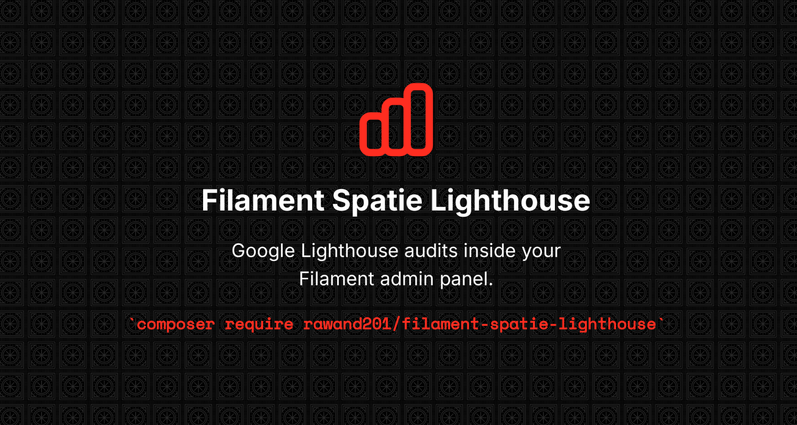

# Filament Spatie Lighthouse

[](https://packagist.org/packages/rawand201/filament-spatie-lighthouse)
[](https://packagist.org/packages/rawand201/filament-spatie-lighthouse)
[](https://packagist.org/packages/rawand201/filament-spatie-lighthouse)
[](LICENSE)



A [Filament](https://filamentphp.com) plugin that integrates [spatie/lighthouse-php](https://github.com/spatie/lighthouse-php) to run Google Lighthouse audits directly from your admin panel — view scores, performance metrics, failed audits, audit history, and full HTML reports without leaving Filament.

---

## Table of Contents

- [Requirements](#requirements)
- [Installation](#installation)
- [Basic Usage](#basic-usage)
- [Plugin Options](#plugin-options)
- [Configuration Reference](#configuration-reference)
- [Raw Results Storage](#raw-results-storage)
- [Queue Support](#queue-support)
- [Scheduled Audits](#scheduled-audits)
- [Notifications](#notifications)
- [REST API Endpoints](#rest-api-endpoints)
- [Artisan Commands](#artisan-commands)
- [Events](#events)
- [Custom Result Store](#custom-result-store)
- [Extending the Page](#extending-the-page)
- [Contributing](#contributing)
- [Credits](#credits)
- [Changelog](#changelog)
- [License](#license)

---

## Requirements

| Requirement           | Version            |
| --------------------- | ------------------ |
| PHP                   | `^8.2`             |
| Laravel               | `^11.0 \| ^12.0`   |
| Filament              | `^4.0 \| ^5.0`     |
| spatie/lighthouse-php | `^2.0`             |
| Node.js               | `^18.0 \| ^20.0 \| ^22.0` |
| `lighthouse` (npm)    | `^12.0`            |
| Chrome / Chromium     | any recent version |

> **Note:** The `lighthouse` npm package must be installed on the server. Run:
> ```bash
> npm install -g lighthouse
> ```
> Then verify: `npx lighthouse --version`
>
> `spatie/lighthouse-php` also requires a Chromium-based browser. See [their documentation](https://github.com/spatie/lighthouse-php#requirements) for full setup.

---

## Installation

**1. Install the package:**

```bash
composer require rawand201/filament-spatie-lighthouse
```

**2. Publish and run the migration:**

```bash
php artisan vendor:publish --tag="filament-spatie-lighthouse-migrations"
php artisan migrate
```

**3. (Optional) Publish the config file:**

```bash
php artisan vendor:publish --tag="filament-spatie-lighthouse-config"
```

**4. Register the plugin in your Filament panel provider:**

```php
use FilamentSpatieLighthouse\FilamentSpatieLighthousePlugin;

public function panel(Panel $panel): Panel
{
    return $panel
        // ...
        ->plugin(FilamentSpatieLighthousePlugin::make());
}
```

That's it. A "Lighthouse Results" page will appear in your panel's navigation.

---

## Basic Usage

Once installed, navigate to the **Lighthouse Results** page in your Filament panel. Enter a URL and click **Run Audit**. The plugin will:

1. Run a Lighthouse audit via `spatie/lighthouse-php`
2. Save the results (scores + raw data)
3. Display category scores, performance metrics, and failed audits

Each row in the results table has actions to:

- **View** the full result detail page
- **View HTML Report** — opens the native Lighthouse HTML report inline
- **Download HTML Report** — downloads the report as a `.html` file
- **Delete** the record

---

## Plugin Options

Customise the plugin when registering it in your panel provider:

```php
FilamentSpatieLighthousePlugin::make()
    ->navigationGroup('Tools')        // set or override the navigation group
    ->navigationLabel('Lighthouse')   // set the nav item label
    ->navigationIcon('heroicon-o-bolt') // set the nav item icon
    ->navigationSort(5)               // set the sort order
    ->authorize(fn (): bool => auth()->user()->can('view lighthouse'));
```

### All available methods

| Method                                   | Type     | Default                    | Description             |
| ---------------------------------------- | -------- | -------------------------- | ----------------------- |
| `navigationGroup(string\|Closure\|null)` | `static` | translation key            | Navigation group label  |
| `navigationLabel(string\|Closure\|null)` | `static` | translation key            | Nav item label          |
| `navigationIcon(string\|Closure)`        | `static` | `heroicon-o-chart-bar`     | Nav item icon           |
| `navigationSort(int\|Closure)`           | `static` | `1`                        | Sort order within group |
| `authorize(bool\|Closure)`               | `static` | `true`                     | Access control callback |
| `usingPage(string)`                      | `static` | `LighthouseResults::class` | Custom page class       |

---

## Configuration Reference

After publishing, edit `config/filament-spatie-lighthouse.php`. Below is the full reference:

### Result Store

```php
// Where to store audit metadata (scores, timestamps, etc.)
// Options: 'database' (default) | 'cache'
'result_store' => env('LIGHTHOUSE_RESULT_STORE', 'database'),
```

### Raw Results Storage

Controls where the large raw Lighthouse JSON (500KB–2MB per audit) is saved:

```php
// Options: 'database' (default) | 'filesystem'
'raw_results_driver' => env('LIGHTHOUSE_RAW_RESULTS_DRIVER', 'database'),

// Laravel disk to use when driver is 'filesystem'
'raw_results_disk'   => env('LIGHTHOUSE_RAW_RESULTS_DISK', 'local'),

// Directory within the disk
'raw_results_path'   => env('LIGHTHOUSE_RAW_RESULTS_PATH', 'lighthouse-results'),
```

See [Raw Results Storage](#raw-results-storage) for details.

### Database

```php
'database' => [
    // Use a specific DB connection (null = app default)
    'connection' => env('LIGHTHOUSE_DB_CONNECTION', null),
],
```

### Cache

```php
// TTL in seconds when using the 'cache' result store
'cache_ttl' => env('LIGHTHOUSE_CACHE_TTL', 86400), // 24 hours
```

### Audit Timeout

```php
// Lighthouse audit timeout in seconds
// When running synchronously, PHP's max_execution_time must be higher than this value
'default_timeout' => env('LIGHTHOUSE_TIMEOUT', 180),
```

### History Retention

```php
// Auto-prune records older than N days (database store only, uses MassPrunable)
// Run: php artisan model:prune --model=FilamentSpatieLighthouse\\Models\\LighthouseAuditResult
'keep_history_for_days' => env('LIGHTHOUSE_KEEP_HISTORY_DAYS', 30),
```

### Default Audit Categories

```php
'default_categories' => [
    'performance',
    'accessibility',
    'best-practices',
    'seo',
],
```

### Queue

```php
'use_queue'          => env('LIGHTHOUSE_USE_QUEUE', false),
'queue_connection'   => env('LIGHTHOUSE_QUEUE_CONNECTION', null),
'queue_name'         => env('LIGHTHOUSE_QUEUE_NAME', 'default'),
'queue_tries'        => env('LIGHTHOUSE_QUEUE_TRIES', 1),
'queue_timeout'      => env('LIGHTHOUSE_QUEUE_TIMEOUT', 300),
```

### Score Thresholds

Controls the colour indicators on score badges:

```php
'score_thresholds' => [
    'good'             => 90, // >= 90 → green
    'needs_improvement' => 50, // >= 50 → orange, < 50 → red
],
```

### Metric Thresholds

Controls the colour indicators on individual performance metrics:

```php
'metric_thresholds' => [
    'first_contentful_paint'  => ['good' => 1800,  'needs_improvement' => 3000,  'unit' => 'ms'],
    'largest_contentful_paint'=> ['good' => 2500,  'needs_improvement' => 4000,  'unit' => 'ms'],
    'speed_index'             => ['good' => 3400,  'needs_improvement' => 5800,  'unit' => 'ms'],
    'total_blocking_time'     => ['good' => 200,   'needs_improvement' => 600,   'unit' => 'ms'],
    'time_to_interactive'     => ['good' => 3800,  'needs_improvement' => 7300,  'unit' => 'ms'],
    'cumulative_layout_shift' => ['good' => 0.1,   'needs_improvement' => 0.25,  'unit' => 'score'],
],
```

### Display Options

Fine-grained control over which UI sections are shown:

```php
'display' => [
    'show_category_scores'       => true,
    'show_audit_info'            => true,
    'show_html_report'           => true,
    'show_performance_metrics'   => true,
    'show_failed_audits'         => true,
    'show_history'               => true,

    // Number of failed audits shown before a "Show All" toggle
    'failed_audits_initial_count' => 10,

    // Max height of the failed audits scrollable container (CSS value)
    'failed_audits_max_height'   => '800px',

    // How many history records to show per URL
    'history_count'              => 5,

    // Table auto-refresh interval (null to disable)
    'table_poll_interval'        => '30s',

    // Toggle individual table row actions
    'table_actions' => [
        'view'          => true,
        'view_html'     => true,
        'download_html' => true,
        'delete'        => true,
    ],
],
```

### Export

```php
'export' => [
    'enabled' => env('LIGHTHOUSE_EXPORT_ENABLED', true),
    'formats' => ['csv', 'json'],
    'disk'    => env('LIGHTHOUSE_EXPORT_DISK', 'local'),
    'path'    => env('LIGHTHOUSE_EXPORT_PATH', 'lighthouse-exports'),
],
```

### Scheduling

```php
'scheduling' => [
    'enabled'           => env('LIGHTHOUSE_SCHEDULING_ENABLED', true),
    'default_frequency' => env('LIGHTHOUSE_SCHEDULE_FREQUENCY', 'daily'),

    // List of URLs to audit on a schedule
    'urls' => [
        // Simple entry — uses default_frequency and desktop form factor
        ['url' => 'https://example.com'],

        // Full entry
        [
            'url'         => 'https://example.com/blog',
            'frequency'   => 'weekly',   // 'hourly' | 'daily' | 'weekly'
            'form_factor' => 'mobile',   // 'desktop' | 'mobile'
        ],
    ],
],
```

### Notifications

```php
'notifications' => [
    'email' => [
        'enabled'       => env('LIGHTHOUSE_NOTIFICATIONS_EMAIL_ENABLED', false),
        'to'            => env('LIGHTHOUSE_NOTIFICATIONS_EMAIL_TO', null),
        'on_failure'    => env('LIGHTHOUSE_NOTIFICATIONS_EMAIL_ON_FAILURE', true),
        'on_completion' => env('LIGHTHOUSE_NOTIFICATIONS_EMAIL_ON_COMPLETION', false),
    ],
    'slack' => [
        'enabled'       => env('LIGHTHOUSE_NOTIFICATIONS_SLACK_ENABLED', false),
        'webhook_url'   => env('LIGHTHOUSE_NOTIFICATIONS_SLACK_WEBHOOK_URL', null),
        'channel'       => env('LIGHTHOUSE_NOTIFICATIONS_SLACK_CHANNEL', null),
        'on_failure'    => env('LIGHTHOUSE_NOTIFICATIONS_SLACK_ON_FAILURE', true),
        'on_completion' => env('LIGHTHOUSE_NOTIFICATIONS_SLACK_ON_COMPLETION', false),
    ],
],
```

### REST API Endpoints

```php
'endpoints' => [
    'enabled'      => env('LIGHTHOUSE_ENDPOINTS_ENABLED', false),
    'secret_token' => env('LIGHTHOUSE_ENDPOINTS_SECRET_TOKEN', null),
    'prefix'       => env('LIGHTHOUSE_ENDPOINTS_PREFIX', 'lighthouse-api'),
],
```

---

## Raw Results Storage

Each Lighthouse audit produces a raw JSON result of **500KB–2MB**. By default this is stored in a `raw_results` database column. For production deployments with frequent audits, this can bloat your database significantly.

The plugin supports opt-in **filesystem storage** — the raw JSON is written to disk (or any Laravel filesystem disk including S3) and only the file path is stored in the database.

### Enable filesystem storage

In `.env`:

```dotenv
LIGHTHOUSE_RAW_RESULTS_DRIVER=filesystem
LIGHTHOUSE_RAW_RESULTS_DISK=local        # or s3, public, etc.
LIGHTHOUSE_RAW_RESULTS_PATH=lighthouse-results
```

Or in `config/filament-spatie-lighthouse.php`:

```php
'raw_results_driver' => 'filesystem',
'raw_results_disk'   => 's3',
'raw_results_path'   => 'lighthouse/raw',
```

### How it works

| Mode                 | `raw_results` column | `raw_result_path` column                                        |
| -------------------- | -------------------- | --------------------------------------------------------------- |
| `database` (default) | Full JSON blob       | `null`                                                          |
| `filesystem`         | `null`               | Path on disk (e.g. `lighthouse-results/abc123-2025-01-01.json`) |

The HTML report view and download actions transparently resolve the raw results from either location — no change is needed to how you use the plugin.

> **Tip:** You can mix both modes in the same database — existing records with `raw_results` continue to work after you switch to `filesystem`.

---

## Queue Support

Running Lighthouse synchronously blocks the web request for up to 3 minutes. For production use, queue audits in a background worker.

Enable queue mode in `.env`:

```dotenv
LIGHTHOUSE_USE_QUEUE=true
LIGHTHOUSE_QUEUE_CONNECTION=redis    # optional, uses default queue connection if omitted
LIGHTHOUSE_QUEUE_NAME=lighthouse     # optional, uses 'default' queue if omitted
LIGHTHOUSE_QUEUE_TIMEOUT=300         # must be > LIGHTHOUSE_TIMEOUT
LIGHTHOUSE_QUEUE_TRIES=1
```

Then run a queue worker:

```bash
php artisan queue:work --queue=lighthouse --timeout=300
```

When queue mode is enabled, clicking "Run Audit" in the UI dispatches a `RunLighthouseAuditJob`. The table polls every 30 seconds by default (configurable via `display.table_poll_interval`) and updates when the job completes.

### Dispatching manually

```php
use FilamentSpatieLighthouse\Jobs\RunLighthouseAuditJob;

RunLighthouseAuditJob::dispatch(
    url: 'https://example.com',
    categories: ['performance', 'seo'],
    formFactor: 'mobile',
    userAgent: 'MyBot/1.0',
    headers: ['Authorization' => 'Bearer secret'],
    throttleCpu: true,
    throttleNetwork: true,
    timeoutSeconds: 180,
    userId: (string) auth()->id(),
);
```

---

## Scheduled Audits

The plugin registers its own schedule using Laravel's `Schedule` facade — you do not need to modify your `app/Console/Kernel.php`.

Configure URLs to audit on a schedule:

```php
'scheduling' => [
    'enabled'           => true,
    'default_frequency' => 'daily',
    'urls' => [
        ['url' => 'https://example.com'],
        ['url' => 'https://example.com/shop', 'frequency' => 'hourly'],
        ['url' => 'https://example.com/blog', 'frequency' => 'weekly', 'form_factor' => 'mobile'],
    ],
],
```

Make sure the Laravel scheduler is running:

```bash
# crontab
* * * * * cd /path-to-your-project && php artisan schedule:run >> /dev/null 2>&1
```

Supported frequencies: `hourly`, `daily`, `weekly`.

You can also dispatch a one-off scheduled job from the command line:

```bash
php artisan lighthouse:schedule https://example.com --form-factor=mobile
```

---

## Notifications

The plugin can send notifications when an audit completes or fails.

### Email

```dotenv
LIGHTHOUSE_NOTIFICATIONS_EMAIL_ENABLED=true
LIGHTHOUSE_NOTIFICATIONS_EMAIL_TO=team@example.com
LIGHTHOUSE_NOTIFICATIONS_EMAIL_ON_FAILURE=true
LIGHTHOUSE_NOTIFICATIONS_EMAIL_ON_COMPLETION=false
```

The email includes the URL, all four category scores, and a timestamp.

### Slack

```dotenv
LIGHTHOUSE_NOTIFICATIONS_SLACK_ENABLED=true
LIGHTHOUSE_NOTIFICATIONS_SLACK_WEBHOOK_URL=https://hooks.slack.com/services/...
LIGHTHOUSE_NOTIFICATIONS_SLACK_CHANNEL=#lighthouse
LIGHTHOUSE_NOTIFICATIONS_SLACK_ON_FAILURE=true
LIGHTHOUSE_NOTIFICATIONS_SLACK_ON_COMPLETION=false
```

The Slack attachment is colour-coded based on the performance score (green ≥ 90, orange ≥ 50, red < 50).

---

## REST API Endpoints

The plugin exposes optional read-only HTTP endpoints for fetching audit results programmatically.

Enable in config:

```dotenv
LIGHTHOUSE_ENDPOINTS_ENABLED=true
LIGHTHOUSE_ENDPOINTS_SECRET_TOKEN=your-secret-token
LIGHTHOUSE_ENDPOINTS_PREFIX=lighthouse-api
```

Authenticate requests by passing the token in a header or query string:

```
X-Lighthouse-Token: your-secret-token
# or
?token=your-secret-token
```

### Available endpoints

| Method | Endpoint                   | Auth | Description             |
| ------ | -------------------------- | ---- | ----------------------- |
| `GET`  | `/{prefix}/health`         | No   | Health check            |
| `GET`  | `/{prefix}/latest?url=...` | Yes  | Latest result for a URL |
| `GET`  | `/{prefix}/results`        | Yes  | All results (paginated) |
| `GET`  | `/{prefix}/results/{id}`   | Yes  | Single result by ID     |

---

## Artisan Commands

### `lighthouse:audit`

Run an audit synchronously and display a score table in the terminal:

```bash
php artisan lighthouse:audit https://example.com
php artisan lighthouse:audit https://example.com --timeout=240
```

### `lighthouse:schedule`

Dispatch an audit job to the queue:

```bash
php artisan lighthouse:schedule https://example.com
php artisan lighthouse:schedule https://example.com --form-factor=mobile --timeout=180
php artisan lighthouse:schedule https://example.com --categories=performance --categories=seo
```

### `lighthouse:list`

List recent audit results:

```bash
# Show last 10 results as a table
php artisan lighthouse:list

# Filter by URL
php artisan lighthouse:list --url=https://example.com

# Show 25 results as JSON
php artisan lighthouse:list --limit=25 --format=json

# Export as CSV
php artisan lighthouse:list --format=csv > results.csv
```

### Auto-pruning old records

The `LighthouseAuditResult` model uses `MassPrunable`. Add this to your scheduler (or run manually):

```bash
php artisan model:prune --model="FilamentSpatieLighthouse\Models\LighthouseAuditResult"
```

Records older than `keep_history_for_days` days (default: 30) are deleted.

---

## Events

The plugin dispatches three events during the audit lifecycle. All events are queue-safe (no non-serializable objects).

| Event                | When                         | Properties                                               |
| -------------------- | ---------------------------- | -------------------------------------------------------- |
| `AuditStartingEvent` | Just before the audit runs   | `$url`, `$categories`, `$formFactor`, `$userId`          |
| `AuditEndedEvent`    | Audit completed successfully | `$url`, `$scores` (array, 0–100 per category), `$userId` |
| `AuditFailedEvent`   | Audit threw an exception     | `$url`, `$exception`, `$userId`                          |

### Listening to events

```php
use FilamentSpatieLighthouse\Events\AuditEndedEvent;
use FilamentSpatieLighthouse\Events\AuditFailedEvent;
use FilamentSpatieLighthouse\Events\AuditStartingEvent;

// In EventServiceProvider or using #[AsEventListener]:

Event::listen(AuditEndedEvent::class, function (AuditEndedEvent $event) {
    // $event->url          — the audited URL
    // $event->scores       — ['performance' => 87, 'accessibility' => 100, ...]
    // $event->userId       — nullable string, set when audit was triggered by a user
});

Event::listen(AuditFailedEvent::class, function (AuditFailedEvent $event) {
    // $event->url
    // $event->exception
    // $event->userId
});

Event::listen(AuditStartingEvent::class, function (AuditStartingEvent $event) {
    // $event->url
    // $event->categories   — array of category strings
    // $event->formFactor   — 'desktop' | 'mobile'
    // $event->userId
});
```

---

## Custom Result Store

Implement the `ResultStore` interface to plug in any storage backend (Redis, DynamoDB, etc.):

```php
use FilamentSpatieLighthouse\ResultStores\ResultStore;
use FilamentSpatieLighthouse\ResultStores\StoredAuditResults\StoredAuditResults;
use Spatie\Lighthouse\LighthouseResult;

class RedisResultStore implements ResultStore
{
    public function save(string $url, LighthouseResult $result): void
    {
        // persist $result->rawResults(), $result->scores(), etc.
    }

    public function latestResults(?string $url = null): ?StoredAuditResults
    {
        // return a StoredAuditResults instance or null
        return new StoredAuditResults(
            url: $url,
            finishedAt: $finishedAt,
            rawResults: $rawResults,
            scores: $scores,
        );
    }

    public function getHistory(?string $url = null, int $limit = 10): array
    {
        // return an array of result arrays
        return [];
    }
}
```

Bind it in a service provider:

```php
use FilamentSpatieLighthouse\ResultStores\ResultStore;

$this->app->singleton(ResultStore::class, RedisResultStore::class);
```

### `StoredAuditResults` constructor

```php
new StoredAuditResults(
    url: string,
    finishedAt: ?Carbon,
    rawResults: array,          // full Lighthouse JSON, keyed by audit id
    scores: array,              // ['performance' => 87, 'accessibility' => 100, ...]
    rawResultPath: ?string,     // filesystem path, or null if stored inline
);
```

---

## Extending the Page

To override any behaviour on the Lighthouse Results page, extend the base class:

```php
namespace App\Filament\Pages;

use FilamentSpatieLighthouse\Pages\LighthouseResults as BaseLighthouseResults;

class LighthouseResults extends BaseLighthouseResults
{
    // Override table columns, actions, header widgets, etc.
}
```

Register it via the plugin:

```php
FilamentSpatieLighthousePlugin::make()
    ->usingPage(\App\Filament\Pages\LighthouseResults::class)
```

---

## Contributing

Contributions are welcome! Please read [CONTRIBUTING.md](CONTRIBUTING.md) before submitting a pull request.

---

## Credits

- **[Rawand](https://github.com/Rawand201)** — author and maintainer
- **[Spatie](https://spatie.be)** — for [spatie/lighthouse-php](https://github.com/spatie/lighthouse-php) and [spatie/laravel-package-tools](https://github.com/spatie/laravel-package-tools)
- **[Filament PHP](https://filamentphp.com)** — for the admin panel framework

See [CREDITS.md](CREDITS.md) for the full list.

---

## Changelog

See [CHANGELOG.md](CHANGELOG.md).

---

## License

MIT — see [LICENSE](LICENSE).
